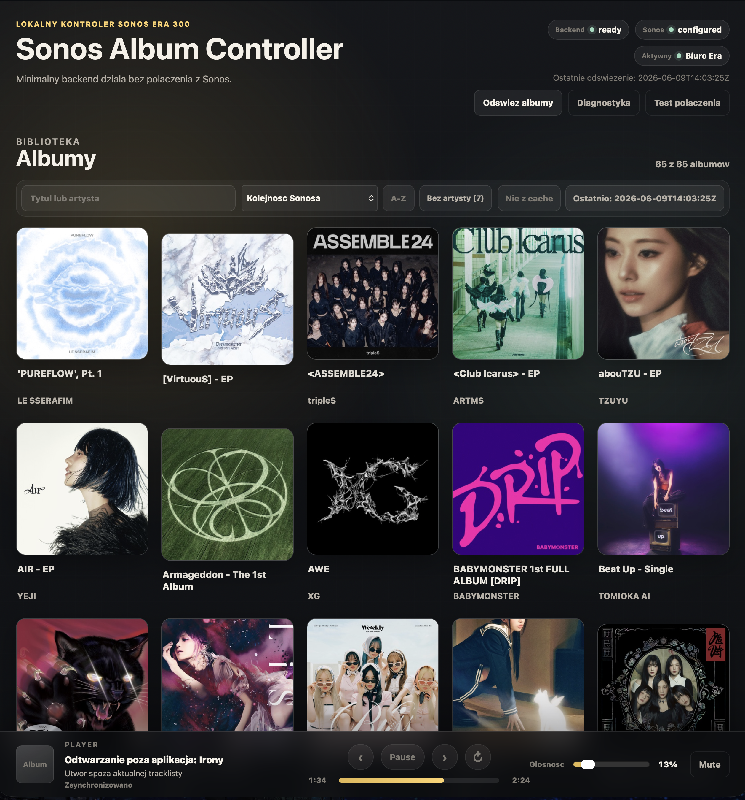

# Sonos-Album-Controller

Sonos Album Controller — lokalna aplikacja webowa do wygodnego odtwarzania ulubionych albumów z Sonos Favorites na głośniku Sonos Era 300.

## Podgląd aplikacji



## Uruchomienie

```bash
uv run uvicorn sonos_album_controller.main:app --app-dir src --reload
```

Po starcie aplikacja jest dostępna pod adresem `http://127.0.0.1:8000`.

## PoC Sonos / SoCo

PoC integracji używa lokalnego IP głośnika z opcjonalnej zmiennej środowiskowej:

```bash
export SONOS_SPEAKER_IP=192.168.1.50
PYTHONPATH=src uv run python -m sonos_album_controller.sonos_poc
```

Bez `SONOS_SPEAKER_IP` komenda zwraca raport `not_configured`, bez próby połączenia z realnym Sonosem.

## PoC discovery Sonos

PoC discovery sprawdza, czy SoCo potrafi wykryć głośniki Sonos w lokalnej sieci bez ręcznie podanego IP:

```bash
PYTHONPATH=src uv run python -m sonos_album_controller.sonos_discovery_poc
```

Komenda zwraca raport JSON z listą wykrytych głośników, stabilnym identyfikatorem jeśli SoCo go udostępnia, nazwą, IP, modelem i podstawową informacją o grupie. Jeśli discovery niczego nie wykryje, zwraca kontrolowany status `not_found`.

## Konfiguracja i diagnostyka

Aplikacja używa tych opcjonalnych zmiennych środowiskowych:

- `SONOS_SPEAKER_IP` - stały adres IP głośnika Sonos jako ręczny override discovery i zapisanego wyboru.
- `SONOS_LOG_PATH` - ścieżka pliku logów; domyślnie `~/.sonos-album-controller/logs/app.log`.
- `SONOS_CACHE_PATH` - zgodnościowy override dokładnej ścieżki pojedynczego pliku cache albumów. Bez tej zmiennej cache aktywnego głośnika jest rozdzielony per stabilny identyfikator pod `~/.sonos-album-controller/cache/speakers/<stable_id>/albums.json`.

Bez `SONOS_SPEAKER_IP` backend wykrywa głośniki Sonos przez SoCo discovery, automatycznie zapisuje jedyny wykryty głośnik albo wymaga wyboru w panelu diagnostyki, gdy wykryto kilka urządzeń. Aktywny wybór jest zapisywany lokalnie poza repo w `~/.sonos-album-controller/speakers/active_speaker.json`.

Endpointy:

- `GET /api/albums` - pobiera albumy z Sonos Favorites / My Sonos, aktualizuje cache po sukcesie i zwraca cache przy błędzie odświeżenia.
- `POST /api/albums/refresh` - wymusza próbę odświeżenia albumów i zachowuje poprzedni cache przy błędzie.
- `GET /api/albums/{album_id}` - zwraca szczegóły albumu, listę utworów jeśli SoCo potrafi ją rozwinąć oraz czytelny komunikat, gdy lista utworów jest niedostępna.
- `POST /api/playback/start` - czyści kolejkę, ładuje cały album i startuje od wybranego indeksu utworu; gdy Sonos nie zwraca listy utworów, uruchamia cały album przez albumowe URI i metadane z Favorites, a następnie odczytuje listę utworów z kolejki Sonosa.
- `POST /api/playback/select` - przeskakuje do wskazanego indeksu w aktualnie załadowanej kolejce albumu bez ponownego czyszczenia i ładowania albumu.
- `GET /api/playback/state` - read-only snapshot aktualnego stanu Sonosa: play/pause, utwór, pozycja, głośność, mute i tryb pętli best effort.
- `POST /api/playback/state` - wznawia albo pauzuje odtwarzanie.
- `POST /api/playback/next` - przechodzi do następnego utworu i respektuje tryb pętli przekazany przez UI.
- `POST /api/playback/previous` - obsługuje poprzedni utwór z regułą 10 sekund i pętlą albumu.
- `POST /api/playback/repeat` - ustawia tryb pętli Sonosa: `none`, `album` albo `track`.
- `POST /api/playback/volume` - ustawia głośność w zakresie 0-100.
- `POST /api/playback/mute` - ustawia mute/unmute.
- `GET /api/diagnostics` - zwraca skonfigurowane IP, status połączenia, ostatni błąd i stan cache.
- `POST /api/diagnostics/test-connection` - wykonuje test połączenia z Sonosem.
- `GET /api/speakers` - zwraca listę wykrytych głośników i aktualny aktywny wybór.
- `POST /api/speakers/scan` - wymusza ponowne skanowanie głośników Sonos.
- `GET /api/speakers/active` - zwraca aktualny aktywny wybór głośnika.
- `POST /api/speakers/active` - zapisuje aktywny głośnik po `stable_id`.

Frontend biblioteki działa lokalnie na aktualnej odpowiedzi `/api/albums`: pozwala wyszukiwać albumy po tytule i artyście bez uwzględniania wielkości liter i znaków diakrytycznych, sortować po kolejności z API/Sonosa, tytule albo artyście, zawężać listę filtrem `bez artysty` oraz pokazuje chipy statusu cache i ostatniego odświeżenia. Stan tych kontrolek trwa tylko w bieżącej sesji strony i nie jest zapisywany w URL ani `localStorage`.

Player okresowo odpytuje `GET /api/playback/state`, żeby zauważać zmiany wykonane poza aplikacją, np. pauzę, zmianę głośności, mute, tryb pętli albo utwór. Polling zatrzymuje się przy ukrytej karcie, nie odświeża biblioteki albumów ani cache i konserwatywnie podświetla tracklistę tylko przy pewnym dopasowaniu.

Ograniczenie realnej integracji: dla aktualnych Apple Music Favorites testowanych na Sonos Era 300 metoda SoCo `MusicLibrary.browse` zwraca 0 utworów. Aplikacja ma fallback odtworzenia całego albumu przez `AddURIToQueue` z albumowym URI i metadanymi Favorites; po załadowaniu albumu odczytuje tytuły i czasy utworów z kolejki Sonosa.

Nazwy artystów albumów Apple Music są uzupełniane best effort przez publiczny Apple/iTunes lookup po identyfikatorze albumu znalezionym w metadanych Sonosa. Brak sieci albo brak wyniku lookupu nie blokuje albumów ani odtwarzania; dla takich albumów UI pomija linię artysty zamiast pokazywać tekst zastępczy.

Jakość audio jest obsługiwana jako best effort. Aktualny PoC SoCo nie potwierdził wiarygodnego pola jakości audio, więc API zwraca neutralny brak wartości, a UI pokazuje `Jakosc niedostepna` bez zgadywania Dolby Atmos lub lossless. Szczegóły techniczne błędów trafiają do pliku logów, a UI pokazuje komunikaty użytkowe.

## Testy

```bash
uv run python -m unittest discover -s tests -p "test_*.py"
```
